# クラス図（自動生成）

`python scripts/generate_class_diagram.py` で更新。直接編集しないでください。

ルート直下のアプリモジュールのトップレベルクラスと公開メソッド・プロパティを表示します。
破線はクラス内の名前参照（型注釈を含む）であり、所有関係や実行時の呼び出しを意味しません。
動的参照、文字列型注釈、別名の型定義経由の参照は解決しません。

```mermaid
classDiagram
    class C0["dot_editor.PixelEditor"] {
        +activate_eraser()
        +activate_eyedropper()
        +activate_fill()
        +add_layer()
        +begin_pan()
        +build_sidebar()
        +change_canvas_size()
        +change_size()
        +choose_color()
        +collapse_selected_cell()
        +commands
        +create_grid()
        +create_toolbar_group()
        +current_detail_policy()
        +discard_selected_detail()
        +hex_to_rgb()
        +image_origin()
        +import_image()
        +load_project()
        +make_snapshot()
        +make_toolbar_button()
        +move_layer()
        +on_canvas_configure()
        +paint_pixel()
        +pan_canvas()
        +perform_edit()
        +push_history()
        +redo()
        +refresh_composite()
        +refresh_layer_list()
        +refresh_tool_state()
        +remove_layer()
        +rename_layer()
        +report_error()
        +reset_canvas()
        +reset_canvas_model()
        +resize_logical_canvas()
        +restore_snapshot()
        +rgb_to_hex()
        +save_image()
        +save_project()
        +select_layer()
        +set_display_size()
        +set_palette_color()
        +set_tool()
        +set_zoom()
        +split_selected_cell()
        +toggle_layer_visibility()
        +undo()
        +update_canvas()
        +update_canvas_size()
        +upscale_resolution()
        +viewport_size()
        +zoom_in()
        +zoom_out()
        +zoom_with_wheel()
    }
    class C1["pixel_backend.PixelCanvas"] {
        +collapse_cell()
        +detail_cells()
        +discard_detail()
        +fill()
        +from_source()
        +has_detail
        +has_detail_at()
        +has_refinements
        +height
        +image
        +import_image()
        +is_split()
        +native_resolution
        +native_size
        +new()
        +paint()
        +redo()
        +render()
        +render_resolution()
        +resize()
        +resolution
        +retained_patch_count
        +retained_resolution
        +sample()
        +save_png()
        +set_resolution()
        +size
        +split_cell()
        +to_source()
        +undo()
        +upscale()
        +width
    }
    class C2["pixel_commands.PixelCommandAPI"] {
        +add_layer()
        +collapse()
        +discard_detail()
        +erase()
        +execute()
        +export_png()
        +fill()
        +import_image()
        +inspect()
        +inspect_sample()
        +is_split()
        +load()
        +move_layer()
        +new()
        +paint()
        +remove_layer()
        +rename_layer()
        +resolution
        +sample()
        +save()
        +select_layer()
        +set_layer_visibility()
        +set_resolution()
        +split()
        +split_region()
        +upscale()
    }
    class C3["pixel_layers.LayeredPixelCanvas"] {
        +active
        +add_layer()
        +collapse_cell()
        +composite()
        +discard_detail()
        +fill()
        +from_source()
        +has_detail
        +has_detail_at()
        +has_refinements
        +height
        +is_layer_visible()
        +is_split()
        +move_layer()
        +native_resolution
        +native_size
        +paint()
        +redo()
        +remove_layer()
        +rename_layer()
        +render_resolution()
        +resize()
        +resolution
        +retained_resolution
        +sample()
        +save_png()
        +select_layer()
        +set_layer_visibility()
        +set_resolution()
        +size
        +split_cell()
        +to_source()
        +undo()
        +upscale()
        +width
    }
    class C4["resolution_field.ResolutionField"] {
        +from_image()
        +from_source()
        +has_detail()
        +render()
        +replace()
        +retained_resolution
        +sample()
        +sample_raw()
        +shift()
        +to_source()
    }
    C0 ..> C1 : references
    C0 ..> C2 : references
    C0 ..> C3 : references
    C1 ..> C4 : references
    C2 ..> C1 : references
    C2 ..> C3 : references
    C3 ..> C1 : references
```

